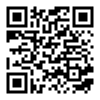

# JavaScript Workshop: Chrome Extension
#### Learn how to build your first Chrome Extension

### Setup: https://info.lewagon.com/tokyo-chrome-ext



By [Trouni Tiet](https://linkedin.com/in/trouni) for [Le Wagon Tokyo](https://www.lewagon.com/tokyo)

---

## Setup

All you need for this workshop is [Google Chrome](https://www.google.com/chrome/) and a text editor or IDE like [Sublime Text](https://www.sublimetext.com/).

##### **TODO:**
1. Clone the git repository for this workshop
```zsh
git clone https://github.com/trouni/workshop-chrome-extension.git
```
2. Alternatively, [download the ZIP file](https://github.com/trouni/workshop-chrome-extension/archive/master.zip) and unzip the archive to your desktop.

---

With ad blockers, integration to third party apps like Evernote or your favourite to-do app, or many humoristic extensions, Chrome extensions can be extremely powerful, but also very fun to use. The good news is that it's also super easy to build a Chrome extension. This workshop will take you step-by-step through the journey of creating and publishing your first Chrome extension, while teaching you the key concepts to understand.

### What to expect from this workshop

Cheese. 🧀

But also, here are key aspects that we'll be covering:
1. What is the basic structure of a Chrome extension
2. How to create (content) scripts that interact with web pages
3. How to pass messages between content scripts and background scripts
4. How to integrate an extension with a third party app
5. How to publish an extension on the Chrome store


## Let's get started!

### Interacting with the DOM using JavaScript

Before we dive into extensions, let's go through a quick JavaScript refresher on how to interact with a web page.
```javascript
// Target element with the id #my-element-id
document.getElementById('my-element-id')

// Target the first element matching the CSS selector
document.querySelector('.css-selector')

// Get an array of all the elements matching the CSS selector
document.querySelectorAll('.css-selector')
```

##### **TODO:**
1. Open the Chrome console *(**⌘ Cmd + ⌥ Opt + J** on MacOS or **✲ Ctrl + ⇧ Shift + J** on Windows)*
2. Replace all the images on the page with beautiful photos of cheese 🧀

> *You can use [Unsplash Source](https://source.unsplash.com), which gives you random images [like this one](https://source.unsplash.com/featured/?cheese), using `https://source.unsplash.com/featured/?cheese`*\
> *Also, I'm not sure why you would want to do that, but you can replace `cheese` in the string with anything you want (e.g. `wine`, `kitten`, `nail-clipper`, etc.)*

Once this is done, let's put this script in a Chrome extension!

### Basic structure of a Chrome extension

The manifest is a simple JSON file that tells the browser about your web application, and it is the only file that every extension using WebExtension APIs must contain.

```javascript
// manifest.json

{
  "manifest_version": 2,
  "name": "My first Chrome Extension",
  "description": "Chrome extension workshop for Le Wagon Tokyo",
  "author": "Your name",
  "version": "0.0.1",
  "permissions": ["tabs"],
  "content_scripts": [
    // ...
  ],
  "background": {
    // ...
  },
  "browser_action": {
    // ...
  },
  "icons": {
    "16": "images/icon16.png",
    "32": "images/icon32.png",
    "48": "images/icon48.png",
    "128": "images/icon128.png"
  }
}

```

### Loading our extension into Chrome

##### **TODO:**
1. Enter `chrome://extensions` in the Chrome search bar, and activate developer mode (top-right corner)
2. Click '**Load unpacked**' and select your workshop-chrome-extension folder.

### Content scripts & Background / Event scripts


**Content scripts** run in the context of a web page / tab, and allow you to get information from it, or even change its contents. On the other side, as its name suggests, a **background script** runs in the background of the Chrome browser, acting as a controller and used to maintain state for your extension.
While content scripts have limited access to the Chrome Extension APIs, background scripts can make full use of them. **As a general rule, content scripts should be used to interact with web pages / tabs, while the logic should ideally be located in the background script.**

#### Creating our first content script

Since it interacts with our page, our image replacing script should go into a content script.

##### **TODO:**
- Add this snippet to the `scripts/cheesify.js` file.
```javascript
document.querySelectorAll('img').forEach( (img) => {
  img.src = `https://source.unsplash.com/${img.width}x${img.height}/?cheese&${Math.random()}`;
  img.srcset = img.src;
})
```

#### Adding our content script to the manifest

##### **TODO:**
- In your manifest, add the following to run our cheesify script on all the pages we visit.

```javascript
// manifest.json

{
  // ...

  "content_scripts": [
    {
      "matches": [
        "<all_urls>"
      ],
      "js": ["scripts/cheesify.js"]
    }
  ],

  // ...
}
```

## Let's add a menu

Our script now runs on every single page we visit, and although I'm definitely loving all that cheesy goodness, I can think of a few situations where replacing all images on the internet with photos of coagulated milk may not be entirely relevant. So let's add a menu to our extension, in order to trigger the cheesification of our page only when we *actually* need it.

### Creating the menu UI in HTML/CSS

##### **TODO:**
- Create your menu or copy-paste the code below into `popup.html`.
```html
<!-- popup.html -->

<!DOCTYPE html>
<html>
<head>
  <meta charset="utf-8">
  <meta http-equiv="X-UA-Compatible" content="IE=edge">
  <title>My first Chrome extension</title>
  <link rel="stylesheet" href="style/popup.css">
</head>
<body>
  <h1>My first Chrome extension</h1>
  <button id="cheesify"><span>🧀</span><p>Cheesify Page</p></button>
  <script src="scripts/popup.js"></script>
</body>
</html>
```
*I have already included some CSS styling in `style/popup.css` for the template above.*

### Adding our menu to the manifest

We need to let Chrome know that the menu for our extension is now in our `popup.html` file.

##### **TODO:**
- Add this to your manifest.json file.
```javascript
// manifest.json

{
  // ...

  "browser_action": {
    "default_popup": "popup.html",
    "default_title": "My first Chrome Extension"
  },

  // ...
}
```

### Passing messages to tabs / content scripts

When we click the button of our `popup.html` page, we should send a message to the `cheesify.js` content script and trigger our image replacement script.

Here are some useful methods to pass messages to content scripts:
```javascript
// Find the tab(s) you want to send a message to by querying the open tabs in Chrome
chrome.tabs.query( queryInfo, (responseCallback) )

// Send a message to a tab when you know its ID
chrome.tabs.sendMessage( tabId, message, (options), (responseCallback) )
```
*Learn more in the [chrome.tabs API](https://developer.chrome.com/extensions/tabs).*

##### **TODO:**
- Let's apply this to our extension and trigger the cheesify script when we click on our button.
```javascript
// scripts/popup.js

document.getElementById('cheesify').addEventListener('click', event => cheesify());

function cheesify() {
  chrome.tabs.query({active: true, currentWindow: true}, function(tabs) { // Finds tabs that are active in the current window
    chrome.tabs.sendMessage(tabs[0].id, { action: 'cheesify' }); // Sends a message (object) to the first tab (tabs[0])
  });
}
```

### Listening for messages in tabs / content scripts

Now, all that's keeping us from turning our web page into dairy heaven is learning how to intercept the message we've just sent, then trigger an action based on that. We will be using the chrome.runtime API and more specifically, the `onMessage.addListener` method:

```javascript
chrome.runtime.onMessage.addListener(
  function(request, sender, sendResponse) {
    // actions based on the request (which corresponds to the object we sent in our message)
  }
);
```
*Learn more in the [chrome.runtime API](https://developer.chrome.com/apps/runtime).*

##### **TODO:**
- Complete/replace your code in cheesify.js with the one below.
```javascript
// cheesify.js

chrome.runtime.onMessage.addListener(
  function(request, sender, sendResponse) {
    if (request.action === 'sendCheesify') cheesify();
  }
);

function sendCheesify() {
  document.querySelectorAll('img').forEach( (img) => {
    img.src = `https://source.unsplash.com/${img.width}x${img.height}/?cheese&${Math.random()}`;
    img.srcset = img.src;
  })
}
```

Awesome! You should now be able to click on the extension's icon, then click on the 'Cheesify Page' button to run our cheesify script. I have also included a basic 'font picker' script for you to play around if you'd like to experiment more with passing messages between the popup and content script.

## 2. Let's make our extension interact with an API

It's now time for us to experiment with background scripts!

The idea for this new feature is to simulate adding a page to a 'Read Later' list. To achieve this, the popup script will capture relevant information (page title & url) from the active tab, then send it to the background script. Finally, we will make a POST request from the background script.

### Setting up a mock API

We will use [PostBin](https://postb.in/) as our mock API, which will allow us to visualize the web pages that we added via our POST request.

##### **TODO:**
1. Go to [PostBin](https://postb.in/) and click '**Create Bin**'
2. Copy the url that appears after **POST** in the examples. The url should look like `https://postb.in/1234567890123-1234567890123`
3. Store this url in the `postBinUrl` variable in the `background.js` file

### Passing messages to the background scripts

Similarly to sending messages to our content scripts using `tabs.sendMessage`, we can send messages to background scripts using `runtime.sendMessage`.

```javascript
chrome.runtime.sendMessage( (extensionId), message, (options), (responseCallback) )
```

##### **TODO:**
1. Add a button to `popup.html` that will add the current web page to our 'Read Later' list
2. Add code in `scripts/popup.js` to capture the current page's information using `chrome.tabs.query({active: true, currentWindow: true}, callback = (tabs) => {})`
3. Send the captured information to the background script using the `chrome.runtime.sendMessage` method.

```html
<!-- popup.html -->

<button id="post-to-api"><span>📖</span>Add to Read List</button>
```

```javascript
// scripts/popup.js

const btnPostToAPI = document.getElementById('post-to-api')
btnPostToAPI.addEventListener('click', event => addItemToList());

function addItemToList() {
  chrome.tabs.query({active: true, currentWindow: true}, function(tabs) {
    btnPostToAPI.disabled = true;
    chrome.runtime.sendMessage({ action: 'postItem', title: tabs[0].title, url: tabs[0].url }, (data) => {
      btnPostToAPI.disabled = false;
    });
  });
}
```

### Listening for messages in the background scripts

Listening is the same in the background or in content scripts, using `chrome.runtime.onMessage.addListener`.

##### **TODO:**
1. Add the background.js script to the manifest
2. Create a function to make a POST request to PostBin using `fetch`
3. Add a message listener to receive the active page information sent by popup.js, then send it to PostBin

```javascript
// manifest.json

{
  // ...

  "background": {
    "scripts": ["scripts/background.js"],
    "persistent": false
  },

  // ...
}
```

```javascript
// scripts/background.js

const postBinUrl = 'https://postb.in/b/#############-#############' // 👈 Paste your PostBin url here

chrome.runtime.onMessage.addListener(
  function(request, sender, sendResponse) {
    if (request.action === 'postItem') postItem(request.title, request.url).then(response => sendResponse(response));
    return true // Necessary when sendResponse() is sent asynchronously so that the script that sent the message waits for the response.
  }
);

const postItem = (title, url) => {
  return fetch(postBinUrl, {
    method: 'POST',
    headers: { "Content-type": "application/json; charset=UTF-8" },
    body: JSON.stringify({ title: title, url: url })
  })
}
```

## Publishing our extension to the store

##### **TODO:**
1. Create your app’s zip file
2. [Create a developer account](https://chrome.google.com/webstore/developer/dashboard)
3. Upload your app
4. Pay the developer's signup fee

*Full official tutorial available [here](https://developer.chrome.com/webstore/publish)*

You can publish unlisted extension and share the direct link if you don't want to make your extension public.

##### **TODO:**
- Show me what you've built! Don't hesitate to contact me and let me know what extensions you've created!

-----
©[CC BY-NC](https://creativecommons.org/licenses/by-nc/4.0/) Workshop/tutorial by **Trouni Tiet**\
[LinkedIn](https://linkedin.com/trouni) | [Github](https://github.com/trouni) | [Instagram](https://instagram.com/trouni)

 Created for [Le Wagon](https://www.lewagon.com) | Coding Bootcamp | **Change your life, learn to code.**
